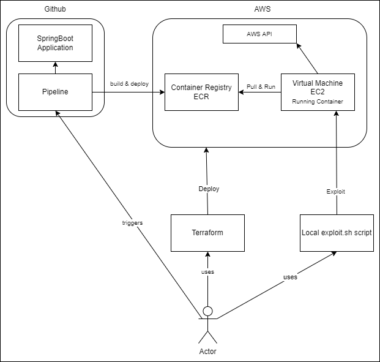

# Code-To-Cloud Xploitation
This repository provides a lab for showcasing the danger of a vulnerable application paired with overly-permissive access.
On the other side there is the cloud infrastructure as terraform to automatically create the cloud environment for the demo.

From Code to Cloud
- [code/](code)
- [cloud/](cloud)
- [Github Pipeline](.github/workflows)

Project architecture:


## Requirements
- Required
    - Local
        - terraform installed locally
        - AWS User Keys to deploy terraform ( local )
        - Global protect must be disabled temporary, otherwise the exploit will fail
        - Prisma Cloud AccessKey & Secret
    - Github
        - Github account to create private fork
        - AWS User Keys to configure Pipeline secrets
        - Prisma Cloud AccessKey & Secret
- Optional
    - ssh public key available (for debugging and customization)

## HowTo - Basic setup
### Create a fork of the repository
Caution: Make sure that the fork is private!

1. Login with your github account
2. Open https://github.com/PaloAltoNetworks/prisma-cloud-exploitation-demo and click on Fork
3. Fork should be available in your account - congratulations

### Download git repository
To perform the `terraform deploy` and running the exploiting scripts the repository should be downloaded.

1. Download the git repository (either https, git, VSCode or download button...)
2. Move into the repository folder
3. Configure your terraform deployment AWS credentials as environment variable (**Caution: Should be different creds than used in the pipeline**)
    - AWS_ACCESS_KEY_ID, AWS_SECRET_ACCESS_KEY & maybe AWS_SESSION_TOKEN
        - Hint: create a .env file based on the .env.template and add all required values to it. After that you can make the variables active in your current terminal window using `source .env`.
4. Execute the terraform init & apply:
```bash
terraform -chdir=cloud init
terraform -chdir=cloud apply
# Info: by default the created EC2 instance is only reachable by your current IP address on Port 22 & 8080. See sg.tf for details.
# Prisma Cloud credentials are used to get the install curl command from the console. The defender will be automatically installed.
```
5. Destroy environment after demo
```bash
terraform -chdir=cloud destroy
# Important: Delete the through the exploit created IAM user manually!
```

This will deploy several resources in your AWS account.
For the proceedings all relevant addresses/outputs are written into `cloud/outputs/variables.env`

The deployment creates an EC2 instance and configures it to automatically pull the latest image from the newly created container registry. It might take a minute to configure everything correctly as docker etc is installed on the EC2 instance in its user_data. Details can be found in the `cloud/templates/ec2.sh` file used as user_data.

This instance has an *overpriviledged role attached* that can be used to open doors into the hosting AWS account.

The second part created is an S3 bucket which contains a script to create automatically an AWS IAM user.  
The IAM user used should have limited access to AWS services. The managed policy `AmazonEC2ContainerRegistryPowerUser` is sufficient.

### Check for Container deployment
The EC2 instance checks regulary every X seconds for new images in the container registry and launches it automatically. After max 1min after deployment to ECR the container should start on your EC2 host.

The EC2 url is provided as terraform output and in the `cloud/outputs/variables.env`.

Check if the Springboot service is running on:
```
<YourInstance>.us-east-2.compute.amazonaws.com:8080/
```

### Exploiting the application
**IMPORTANT:** Trigger the exploit only once, otherwise the web shell might misbehave.

**READ THIS SECTION FIRST AND THEN EXECUTE IT**

This repository provides two scripts for exploitation - *execute either one or the other*:

**gain_access.sh** will create the webshell using exploit.sh, install curl and use our `cloud/templates/create_iam_user.sh` script in S3 to create a new **IAM admin user** with activated Console Login. **IMPORTANT**: Make sure to remove the account once you've finished your demo.

The username used for login can be configured in `var.tf` -> `user_name` - thereby you can ask the audience for a color, username or whatever and simply add it there. After updating the `var.tf` and executing `terraform apply` the new username will be reflected.
```bash
./gain_access.sh
```

**exploit.sh** will create a webshell under <HOST>:8080/shell.jsp?cmd=<AnyCommand>

```bash
./exploit.sh
```

#### Demo with automated defender deployment
The defender can be installed automatically on instance creation leveraging the user_data or via SSH.
For automated installation via user_data update `var.tf` **deploy_defender** to **true**. Thereby during terraform create the curl script is received from the console and added to the user_data.

For installation via SSH follow the known container defender deploy steps.

#### SSH Access
Accessing the EC2 instance is possible via SSH. The terraform script will create automatically a key in the environment based on var.tf public key definition. Therefore you'll need to add your local public key (e.g. `cat ~/.ssh/id_ed25519.pub` into `var.tf`.
Access the EC2 instance via SSH (public key as defined in `var.tf`)
```bash
ssh -i ~/.ssh/<YOURKEY> ubuntu@<HOST>
```

To restart the container (after exploiting) on the AWS EC2 instance in a clean state use connect via SSH and execute
```bash
./restart_clean_container.sh
```

#### Debugging
The instance can be accessed via SSH. The public key can be set as variable defined in `var.tf`. Then commands like `docker ps` etc can be used for debugging purpose.

Check if the service is running in the EC2 instance
```bash
systemctl status springboot.service
```
